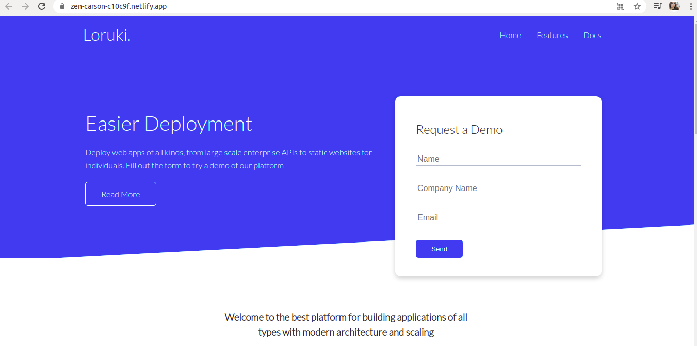

# Loruki Website 
We will be replicating the fake cloud hosting website Lokuri Website in groups, according to the current module [Incremental Development](https://github.com/HackYourFutureBelgium/incremental-development)

## Table of contents
- [Loruki Website](#loruki-website)
  - [Table of contents](#table-of-contents)
  - [General info](#general-info)
  - [Group Info](#group-info)
  - [Assigned Coach](#assigned-coach)
  - [Screenshots](#screenshots)
  - [Technologies](#technologies)
  - [Status](#status)
  - [Contributions](#contributions)
  - [Contributing](#contributing)
  - [License](#license)

## General info
Making a responsive web design that simulates a platform for building applications of all types with modern architecture and scaling. We will work along with Git and GitHub. This project in intent to be complete it by the first week of Incremental Development in HYF Belgium program.

## Group Info
- [Zehra ](https://github.com/zehrayelkenci)
- [Selim ](https://github.com/selimensar)
- [Furkan](https://github.com/emelysalmeron)
- [Joexy](https://github.com/Joexy1990)
- [Zara](https://github.com/zaraana)
- [Emely](https://github.com/emelysalmeron)
- [Kazem](#)
## Assigned Coach 
- [Unmesh](https://github.com/unmeshvrije)

## Screenshots

## Technologies
Project is created with:

* HTML5
* CSS

## Status

In progress.

## Contributions

All contributions are welcome.

## Contributing
Pull requests are welcome. For major changes, please open an issue first to discuss what you would like to change.

Please make sure to update tests as appropriate.

## License
[MIT](https://choosealicense.com/licenses/mit/)